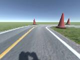

# AI For Autonomous Vehicles

## Predicting steering angles from images using Convolutional Neural Networks

In this workshop we will investigate one approach to self-driving using the so called end-to-end training. Unlike the previous workshops where a model was trained, this time we will use a pre-trained model.

[][colab_jp_nb_link] 
 
[colab_jp_nb_link]: https://colab.research.google.com/github/dsikar/ai-for-autonomous-vehicles/blob/master/AIForAutonomousVehicles.ipynb

We have a set of images from a simulated circuit generated with the Unity game engine, and a corresponding set of labels - the recorded steering angles at the time each image was saved. In this case, the car was driven one lap around the circuit with a PID (proportional-integral-derivative) algorithm, as used in industrial automation processes such as temperature control, whereby if the car deviates from the path, the steering is corrected to approximate the direction of travel to the path.

[Slides](https://github.com/dsikar/msc-dissertation-latex/blob/master/Evaluation%20of%20self-driving%20cars%20using%20CNNs%20in%20the%20rain.pdf) | [Dissertation](https://github.com/dsikar/msc-dissertation-latex/blob/master/Daniel_Sikar_MSc_Project_Report.pdf) | [Dissertation Latex files](https://github.com/dsikar/msc-dissertation-latex)

Training dataset track:  

Ground truth steering angles (multiplied by normalisation constant (25 degrees, maximum Unity steering angle):  

Example 1 - images/100_cam-image_array_.jpg  
Steering angle label - labels/record_100.json  
Normalised ground truth: [-0.0005910187028348446 (x 25 = -0.02)](labels/record_100.json)  
  

Example 2 - images/200_cam-image_array_.jpg  
Steering angle label - labels/record_200.json  
Normalised ground truth: [0.5147194862365723 (x 25 = 12.9)](labels/record_200.json)  
  

Example 3 - images/600_cam-image_array_.jpg  
Steering angle label - labels/record_600.json  
Normalised ground truth: [-0.12861526012420655 (x 25 = -3.2)](labels/record_600.json)  
  
